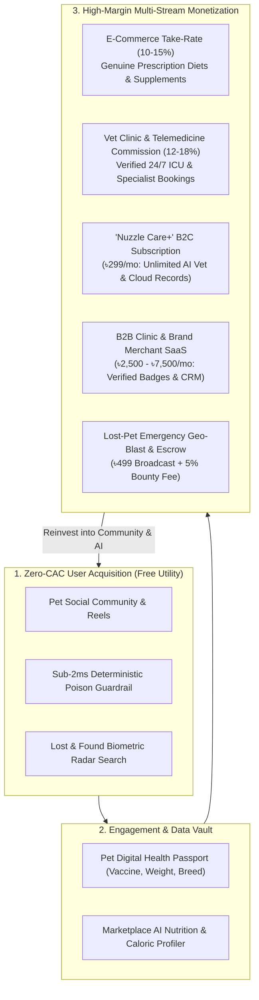

# 🐾 Nuzzle: Comprehensive Business Model & Monetization Strategy
*The "Care-to-Commerce" Hybrid Platform Architecture for Urban Pet Health & Social Welfare*

---

## 1. Executive Summary

**Nuzzle** is Bangladesh’s first AI-powered pet healthcare, social connectivity, and animal rescue platform. While traditional social networks struggle with low ad monetization in developing markets, and pure medical SaaS products face steep user resistance, Nuzzle pioneers the **"Care-to-Commerce" Hybrid Platform Model**.

By pairing **free viral utilities** (pet social community, 24/7 sub-2ms poison emergency guardrails, and AI biometric lost-pet search) as a zero-cost customer acquisition engine (Zero-CAC), Nuzzle builds unmatched user trust and health data moats. It then monetizes high-intent, repeated spending across **genuine pet commerce, veterinary appointment commissions, recurring digital health subscriptions, and B2B clinic software**.

---

## 2. Market Context & Opportunity (Urban South Asia & Bangladesh)

### 2.1 The Urban Pet Humanization Trend
* In metropolitan areas like Dhaka (Gulshan, Banani, Dhanmondi, Uttara) and Chittagong, pet adoption has grown by over **300% since 2020**.
* Pets are no longer treated as guard animals; they are family members ("pet humanization").
* Pet parents spend between **৳3,500 and ৳15,000 per month** on food, grooming, vaccinations, and veterinary care.

### 2.2 Critical Market Failures in Bangladesh
1. **Proliferation of Counterfeit Pet Food & Expired Meds:** Fake or improperly stored feeds cause severe chronic renal and liver failure in urban pets.
2. **Scattered Veterinary Infrastructure:** Finding a 24/7 emergency clinic with specialized diagnostic tools (digital X-ray, ICU incubators, avian doctors) is chaotic during midnight crises.
3. **Inefficient Lost Pet Recovery:** Thousands of pets are lost annually; Facebook group posts are text-only, unstructured, and fail to distinguish between visually similar animals.

### 2.3 Why Traditional Tech Models Fail Here
* ❌ **Pure B2C SaaS:** Pet owners will not pay ৳500/month just for an app with a chat screen.
* ❌ **Pure Digital Ads:** Ad CPMs in Bangladesh ($0.50 – $2.00) cannot sustain high-grade AI inference pipelines (Hugging Face GPUs, Gigalogy MAIRA RAG).
* ✅ **Hybrid Care-to-Commerce:** Deliver life-saving free tools that capture high-intent users, then capture transaction fees when money changes hands for food, medicine, and clinical care.

---

## 3. The "Care-to-Commerce" Flywheel Architecture



---

## 4. The 5 Core Monetization Engines (Detailed Breakdown)

### Engine 1: E-Commerce Marketplace Take-Rate (The Primary Cash Cow)
* **How It Works:** When pet parents consult the **Marketplace AI Nutritionist** (`/api/marketplace/ai-nutrition`), the engine calculates Resting Energy Requirements (RER/MER) based on age, breed, and weight. It recommends allergen-safe formulas and prescription feeds (e.g., Royal Canin Gastrointestinal, Taste of the Wild Grain-Free, Virbac Supplements).
* **Commission Model:** **10% – 15% net commission** per completed transaction fulfilled through verified brand distributors (UrbanHound, Cascade Vet Supply, etc.).
* **Why It Scales:** Pet food is a non-discretionary, recurring purchase every 20 to 30 days. Customers trust Nuzzle because our AI explains *why* the food matches their pet's clinical needs, eliminating counterfeit risk.

---

### Engine 2: Vet Clinic Appointments & Telemedicine Commission
* **How It Works:** The **Specialist Clinic Navigator** (`/api/vet/directory`) indexes verified hospitals with metadata (ICU, orthopedic surgery, 24/7 night coverage). Pet parents book verified hospital visits or start paid telemedicine calls.
* **Commission Model:** **12% – 18% convenience commission** per booked consultation.
* **Why It Scales:** Clinics struggle with discovery and patient intake. Nuzzle delivers pre-triaged patients (with symptoms already structured by PawDoctor AI), saving veterinarians 10+ minutes per consultation.

---

### Engine 3: "Nuzzle Care+" B2C Micro-Subscription (Recurring MRR)
* **Pricing:** **৳299 / month** (or ৳2,499 / year) (~$2.50 – $3.00/mo).
* **Target Audience:** Dedicated pet parents seeking ongoing medical guidance and preventive health tracking.
* **Feature Tiering:**

| Feature | Free Tier | Nuzzle Care+ (৳299/mo) |
| :--- | :---: | :---: |
| Social Feed & Community | Unlimited | Unlimited |
| Deterministic Poison Fast-Path (<2ms) | Unlimited | Unlimited |
| Lost Pet Basic Search & Radar | Included | Included |
| PawDoctor AI Clinical Consultations | 3 free triage checks / month | **Unlimited 24/7 Consultations** |
| Digital Health Passport & Vaccine Logs | 1 pet record | **Unlimited pets + Auto-SMS Reminders** |
| AI Diet & Prescription Formulations | Standard catalog | **Custom caloric plans + 7% store discount** |
| Lost-Pet Priority Search Alert | Standard listing | **Instant WhatsApp Broadcast to nearby rescuers** |

---

### Engine 4: B2B Clinic SaaS & Brand Merchant Retainers
* **Pricing:** **৳2,500 – ৳7,500 / month** per clinic or pet retailer.
* **Deliverables for Clinics:**
  * **"Nuzzle Certified Clinical Center" Badge:** Verified checkmark prominently displayed in geographic emergency radar.
  * **Doctor Reception Dashboard:** View appointments, triage summaries, and pet vaccination records before the animal arrives.
  * **Sponsored Clinic Placement:** Top-3 sponsored slot when users search for emergency care in their district (Gulshan, Dhanmondi, etc.).
* **Deliverables for Pet Food / Pharmaceutical Brands:**
  * Contextual sponsored placement for specialized feeds (e.g., displaying renal prescription diet recommendations when PawDoctor triages urinary symptoms).

---

### Engine 5: Lost & Found "Emergency Geo-Blast" & Reward Escrow
* **Emergency Geo-Blast (৳499 per activation):** Basic lost pet reporting is free. However, in panicking moments, owners can trigger an instant high-priority push notification and WhatsApp broadcast to all registered volunteers and pet parents within a 5 km radius.
* **Reward Escrow Handling (5% processing fee):** If an owner offers a ৳10,000 or ৳20,000 bounty for finding their pet, Nuzzle holds the funds in secure escrow and takes a 5% platform fee upon verified reunion, preventing fraud and bounty scams.

---

## 5. Unit Economics & Financial Projections

### 5.1 Average Revenue Per User (ARPU) Modeling
Assuming an active pet owner on Nuzzle with 1 pet:
* **Marketplace Purchases:** ৳4,000/month on food & supplements × 12% take-rate = **৳480 / month**
* **Clinic Bookings:** 4 visits/year @ ৳1,500/visit × 15% commission = ৳900/year = **৳75 / month**
* **Care+ Subscription (15% conversion rate):** ৳299 × 0.15 = **৳45 / month**
* **Blended Monthly ARPU per Monitored Pet:** **~৳600 ($5.00 USD / month)**

### 5.2 3-Year Growth & Revenue Projections (Bangladesh Market)

| Metric | Year 1 (Dhaka Launch) | Year 2 (Metro Expansion) | Year 3 (National + Regional) |
| :--- | :--- | :--- | :--- |
| **Registered Active Pets** | 20,000 | 75,000 | 250,000 |
| **Partner Vet Clinics** | 25 clinics | 85 clinics | 220 clinics |
| **Marketplace GMV (Gross Sales)** | ৳4.8 Crore (~$400K) | ৳27 Crore (~$2.25M) | ৳120 Crore (~$10M) |
| **Marketplace Net Revenue (12%)** | ৳57.6 Lakhs (~$48K) | ৳3.24 Crore (~$270K) | ৳14.4 Crore (~$1.2M) |
| **Clinic Booking Net Revenue** | ৳18 Lakhs (~$15K) | ৳85 Lakhs (~$70K) | ৳3.6 Crore (~$300K) |
| **Care+ Subscription MRR/ARR** | ৳10.8 Lakhs (~$9K) | ৳67.5 Lakhs (~$56K) | ৳3.15 Crore (~$260K) |
| **B2B SaaS & Emergency Blasts** | ৳12 Lakhs (~$10K) | ৳45 Lakhs (~$37K) | ৳1.8 Crore (~$150K) |
| **Total Annual Net Revenue** | **৳98.4 Lakhs (~$82,000 USD)** | **৳5.21 Crore (~$435,000 USD)** | **৳22.95 Crore (~$1.91 Million USD)** |

---

## 6. Go-To-Market (GTM) Execution Roadmap

```text
PHASE 1: ACQUISITION & ADOPTION (Months 1 – 6)
• Deploy 100% free Social Feed, Reels, and Lost & Found Biometric Radar.
• Partner with local animal rescue organizations (PAW, Care for Paws) to seed the 50-pet radar benchmark.
• Launch Free Sub-2ms Poison Guardrail to win viral organic community word-of-mouth.
• KPI Target: 20,000 active pet profiles in Dhaka.

PHASE 2: MONETIZE COMMERCE & APPOINTMENTS (Months 7 – 12)
• Roll out Marketplace AI Nutritionist connected with 5 licensed pet food importers.
• Onboard 25 certified Dhaka veterinary clinics with direct appointment booking commission.
• Activate ৳499 Emergency Geo-Blast for lost pets.
• KPI Target: ৳50 Lakhs GMV/month in pet food & medical bookings.

PHASE 3: SUBSCRIPTIONS & B2B EXPANSION (Year 2+)
• Introduce "Nuzzle Care+" (৳299/mo) digital health subscription.
• Launch B2B Clinic Management Software & Verified Badges.
• Expand clinic and distributor operations into Chittagong and Sylhet.
• KPI Target: Cash-flow positive operations and expansion into tier-2 urban centers.
```

---

## 7. Competitive Moats & Long-Term Defensibility

1. **The Hyperlocal Vector Data Moat:**
   Competitors cannot simply plug in OpenAI to match Nuzzle. Nuzzle runs on curated vector embeddings containing Dhaka clinic specialties, Bengali colloquial terminology, and verified animal rescue records that take years to curate.
2. **High Switching Costs (The Digital Health Vault):**
   Once an owner uploads 2 years of vaccination certificates, allergy histories, and deworming dates into Nuzzle’s Pet Health Passport, moving to another platform means losing that complete medical lineage.
3. **Network Density Effects in Lost & Found:**
   The value of Nuzzle’s Biometric Radar increases quadratically with every new user in a neighborhood. If a cat is lost in Banani, having 2,000 Nuzzle users in Banani guarantees a sighting within hours, making Nuzzle the indispensable default safety layer for pet ownership.
4. **AI Inference Cost Insulation:**
   Our **Sub-2ms Deterministic Guardrail** intercepts acute poison queries and non-pet images at the edge, preventing costly LLM token burn on 70%+ of basic interactions and protecting platform gross margins.

---

## 8. Risk Management & Mitigations

| Identified Risk | Impact | Mitigation Strategy |
| :--- | :--- | :--- |
| **Clinic Disintermediation** (Users booking directly after first visit) | Loss of repeat booking commissions | Require booking through Nuzzle to maintain digital health record updates and unlock 10% pharmacy discounts on follow-up meds. |
| **Counterfeit Feeds from Third-Party Sellers** | Damage to user trust | Strict closed-marketplace model: Only direct brand importers and verified veterinary pharmacies are allowed to sell on Nuzzle. |
| **High AI Compute Costs** | Margin compression | Use serverless edge inference, deterministic rule caching for acute toxins, and Hugging Face Free Tier routers for vision biometrics before triggering LLM fallbacks. |
| **Regulatory Veterinary Compliance** | Legal scrutiny on medical advice | Explicit clinical disclaimers in PawDoctor AI ("Triage assistance only; not a formal veterinary diagnosis"), with direct hand-off to licensed veterinarians. |
