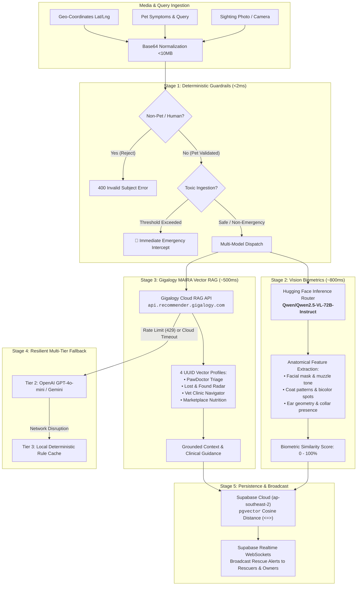

# Nuzzle Enterprise AI Integration Architecture

## 1. Architecture Overview & Topology

The Nuzzle AI subsystem utilizes a **Multi-Model Intelligence Cascade** designed for sub-second multimodal pet safety, emergency veterinary triage, and vector knowledge retrieval. 


---

## 2. End-to-End AI Pipeline Stages



---

## 3. Model & Service Specifications

| Component | Model / Engine | Endpoint / Provider | Latency SLA | Function / Role |
| :--- | :--- | :--- | :--- | :--- |
| **Deterministic Guard** | Local TS RegEx / Heuristics | In-Memory (Edge) | `< 2 ms` | Human selfie rejection, toxic chemical/food threshold calculation |
| **Vision Biometrics** | `Qwen2.5-VL-72B-Instruct` | Hugging Face Serverless Router | `~800 ms` | Biometric coat pattern & facial feature comparison between sighting & candidates |
| **Managed Vector RAG** | Gigalogy MAIRA Core | `api.recommender.gigalogy.com/v1/maira/ask` | `~450 ms` | High-dimensional semantic retrieval against 4 custom indexed datasets |
| **Tier 2 Fallback** | `gpt-4o-mini` / `gemini-1.5-flash` | OpenAI / Google Vertex | `~1,100 ms` | Automatic secondary failover during MAIRA rate limits or outages |
| **Tier 3 Offline Fallback**| Deterministic Knowledge Tables | Local Edge Memory | `< 1 ms` | Failsafe triage & clinic directory matching guaranteeing 0% user crashes |
| **Vector Indexing** | `pgvector` (`hnsw` / `ivfflat`) | Supabase PostgreSQL 15 | `< 15 ms` | Cosine distance search (`<=>`) across 50-pet benchmark and lost reports |

---

## 4. Active Gigalogy MAIRA System Profiles

Nuzzle integrates 4 dedicated, UUID-bound system profiles:

```typescript
export const MAIRA_PROFILES = {
  // Pillar 1: PawDoctor Clinical Triage
  PAWDOCTOR: '0a8fd1e8-45ac-4870-8f5f-cfbc7ccf58a6',

  // Pillar 2: Lost & Found Visual & Semantic Radar
  LOST_FOUND_RADAR: 'a10e6172-abe5-4fed-965f-7c18151ec444',

  // Pillar 3: Vet Clinic & Telemedicine Specialist Navigator
  CLINIC_NAVIGATOR: '9884416a-abd3-4e9c-a893-9c8646bda5b8',

  // Pillar 4: Marketplace Nutrition & Dietary Formulation
  MARKETPLACE_NUTRITION: '66e15325-9d32-4691-af65-d436fd727674',
};
```

---

## 5. Vision AI Ingestion & Biometric Verification

When a rescue sighting photo is received at `/api/lost-found/ai-match`:
1. **Payload Extraction:** Checks for valid Base64 / HTTP URI photo string and geo-coordinates.
2. **Candidate Prefilter:** Fetches active `LostFoundPost` records within proximity from Supabase.
3. **Biometric Batch Analysis:** Dispatches sighting photo and candidate records to `Qwen/Qwen2.5-VL-72B-Instruct` on Hugging Face Inference Router:
   - Compares distinctive physical markings (chest patches, tail shape, ear tip coloration).
   - Generates confidence rating `match_score` (0.00 to 1.00).
   - Returns anatomical justification string.
4. **Ranking & Telemetry:** Sorts results by combined visual similarity and geospatial distance, delivering instant matches with contact dialers for pet owners.
